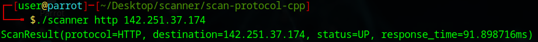

# Network Scanner in C++

This is a simple network scanner implemented in C++. The program scans a given domain for the availability of various network protocols, such as HTTP, HTTPS, FTP, and SSH, and reports the status and response time.

## Features

- **Protocol Scanning**: Supports HTTP, HTTPS, FTP, and SSH protocols.
- **Response Time Measurement**: Calculates the response time for each protocol.
- **Cross-Platform**: Uses socket programming to connect and check server availability.

## Protocol Enum

The `Protocol` enum defines the supported protocols:
- `HTTP` (Port 80)
- `HTTPS` (Port 443)
- `FTP` (Port 21)
- `SSH` (Port 22)
- `UNKNOWN`: Used for unsupported or unrecognized protocols.

## ScanResult Class

The `ScanResult` class stores the results of the scan:
- `protocol_`: The protocol used in the scan (e.g., HTTP, HTTPS).
- `destination_`: The domain or IP address of the destination.
- `status_`: The result of the scan ("UP" or "DOWN").
- `response_time_`: The time taken for the server to respond, measured in milliseconds.

### Method:
- `toString()`: Returns a formatted string representing the result of the scan.

## NetworkScanner Class

The `NetworkScanner` class performs the actual network scan:
- **Constructor**: Initializes the scanner with the target domain.
- **scan() Method**: Accepts a `Protocol` enum value and scans the corresponding port for that protocol.
- **perform_scan()**: Handles the socket connection to the given port and determines if the server is up or down.

## Usage

The program expects two arguments:
1. **Protocol**: The protocol to scan (e.g., `http`, `https`, `ftp`, `ssh`).
2. **Domain**: The target domain or IP address.

Example:

```bash
./scanner http 142.251.37.174
```

This will scan the HTTP protocol on the specified domain and report the result.
<br>


`142.251.37.174` -> google.com